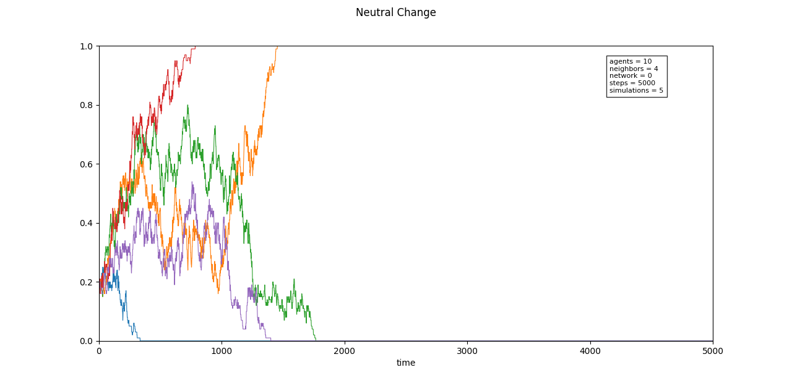
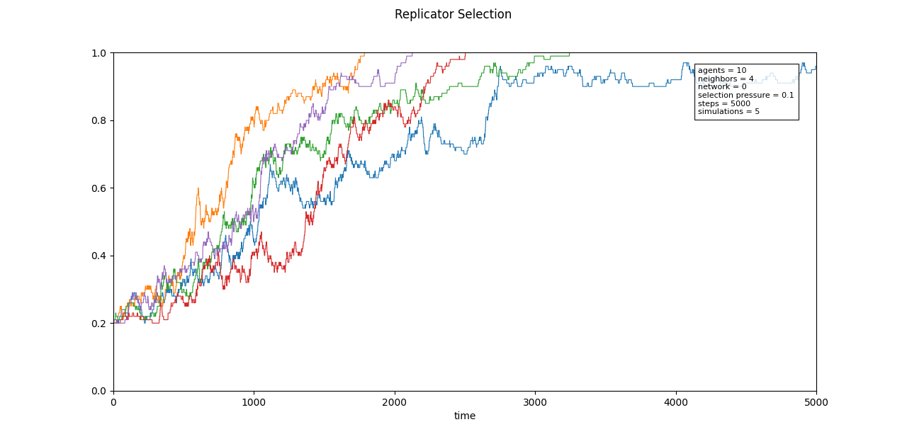
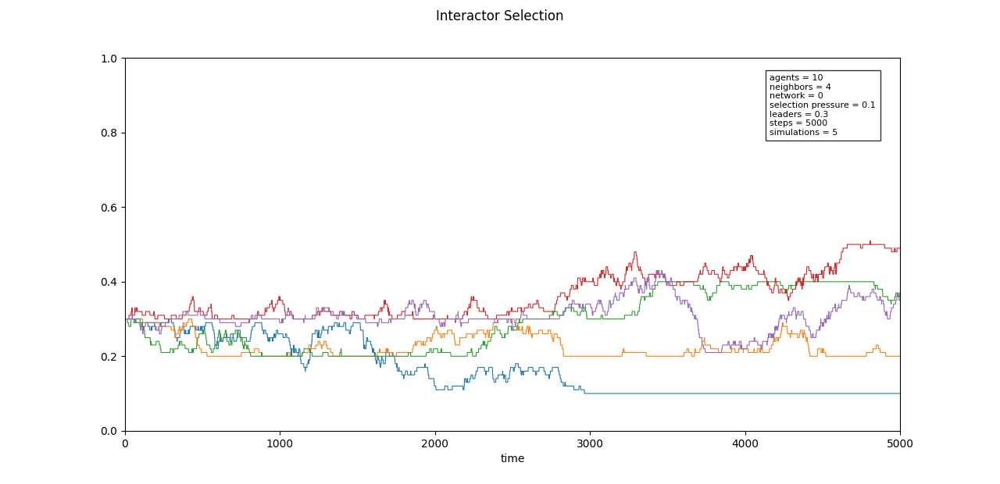

# Thesis Project for Master of Arts in General Linguistics
***Exploring the Effects of Population Size on Language Change: An Integrated Approach using Agent-Based Modeling and Statistical Analysis***

**Seminar für Sprachwissenschaft | Universität Tübingen**

**Abstract**

The effect of population size on language change has been the subject of a range of linguistic studies, with results differing in their evaluation of its significance. This thesis aims to contribute to this discussion by applying a hybrid approach that integrates agent-based modeling and statistical analysis. The implemented agent-based model is a multi-speaker Moran model. It is used to simulate language change under the action of neutral change, replicator selection, and interactor selection. The data generated by this model are then subjected to a quantitative analysis using multiple linear regression. The statistical analysis reveals that population size significantly affects language change when selection is at play, both in terms of replicator and interactor selection. Notably, the calculated effect sizes indicate a stronger relationship between population size and language change given the presence of replicator selection. Furthermore, the study shows that replicator selection is the only mechanism by which an innovation can completely replace a convention or become the predominant variant. 

## The multi-speaker Moran model
### Usage / Examples
To use the model implemented in this repository, run the following command first: ```git clone https://github.com/yuliyamkh/thesis_project.git```

To run first experiments with the [multi-speaker Moran model](https://github.com/yuliyamkh/ABM_AgentPy/blob/master/model.py), make sure to install the packages listed in [requirements.txt](https://github.com/yuliyamkh/ABM_AgentPy/blob/master/requirements.txt). After that, you can perform the following step: ```python model.py```. Consider that this command runs the default model, i.e., the model with the mechanism of neutral change (drift). The default parameter setup is provided below.

| Argument          | Description                            | Default        |
|-------------------|----------------------------------------|----------------|
| ```--ps```        | Number of agents                       | 10             |
| ```--ifs```       | Initial innovation frequency           | 0.2            |
| ```--n_ns```      | Average number of neighbours per agent | 4              |
| ```--rp```        | Rewiring probability                   | 0              |
| ```--sp```        | Selection pressure/strength            | 0.1            |
| ```--nls```       | Proportion of leaders                  | 0.1            |
| ```--sim_steps``` | Number of simulation steps             | 100000         |
| ```--exp_num```   | Number of experiments                  | 5              |
| ```--m```         | Mechanism name                         | neutral_change |

To see some more information on arguments, you can also execute the following command: ```python model.py --help```. You can change the default arguments to the ones you want to experiment with. Examples of the default model (with the neutral change mechanism), the model with the replicator selection mechanism and the model with the interactor selection mechanism are shown below.

#### Example 1: Neutral change
Command: ```python model.py --sim_steps 5000```



#### Example 2: Replicator Selection
Command: ```python model.py --m replicator_selection --sim_steps 5000```



#### Example 3: Interactor Selection
Command: ```python model.py --m interactor_selection --sim_steps 5000 --nls 0.3```




### Experiment / Output / Visualisation
1. To conduct an experiment using the model with a specific mechanism of language change and to save the generated output in CSV format, run the following command: ```python experiment.py --mechanism <mechanism_name> --simulations <number_of_simulation_runs> --exp_id <experiment_ID>```. If you want to specify your own output directory, use the additional argument: ```--output_dir <path_to_output_directory>```. To see more information on additional arguments that can be modified, use the following command: ```python experiment.py --help```. For example, one can specify the own minimum ```--min_N``` and maximum ```--max_N``` population sizes and determine the initial state of the model ```--in_p```, i.e. the initial fraction of the innovative variant. The default parameters of [experiment.py](https://github.com/yuliyamkh/ABM_AgentPy/blob/acf9f5748fd38aad6fe09cfc1aab0d360a01e97e/experiment.py) are the parameters used in the experiments in the [Master's thesis](https://github.com/yuliyamkh/thesis-project/blob/master/MA_Thesis.pdf).

2. To merge the generated output into one single CSV file, run ```python merge.py --mechanism <mechanism_name>```. To specify your own source directory (where the output from the previous step is stored) and your own output directory for the final CSV file, use the two arguments: ```--source <path_to_source_directory>``` and ```--out_dir <path_to_output_directory>```.

3. To visualise the results, execute the command ```python visualise.py --directory <path_to_CSV_file> --mechanism <mechanism_name>```.